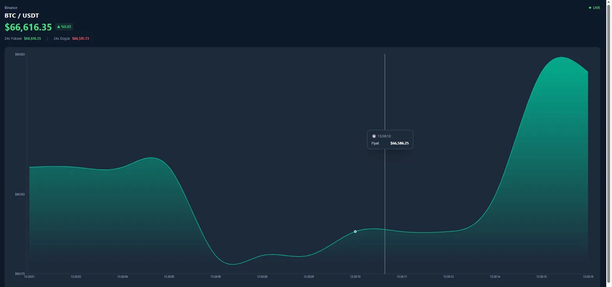

Copy

📈 BTC/USDT Canlı Grafik Uygulaması
Binance borsasından WebSocket ile canlı BTC/USDT fiyat verisini çeken ve gerçek zamanlı güncellenen grafik uygulaması.

🚀 Canlı Demo
btc-live-chart.vercel.app

 WebSocket Bağlantısı
wss://stream.binance.com:9443/ws/btcusdt@trade
Her trade gerçekleştiğinde anlık fiyat verisi alınır.

📸 Ekran Görüntüsü

✨ Özellikler

📊 Canlı güncellenen alan grafiği
🟢 WebSocket bağlantı durumu göstergesi (LIVE / Bağlanıyor / Yeniden Bağlanıyor)
🔄 Otomatik yeniden bağlanma (reconnect) özelliği
📈 Oturum bazlı yüksek/düşük fiyat takibi
🎨 Fiyat yönüne göre dinamik renk (yeşil/kırmızı)
⚡ Performans için 1 saniyelik throttle
🗃️ Maksimum 50 veri noktası (memory yönetimi)

🏗️ Proje Yapısı
src/
├── hooks/
│   ├── useWebSocket.js     → Bağlantı, reconnect, status yönetimi
│   └── usePriceData.js     → Veri işleme, throttle, High/Low hesaplama
├── components/
│   ├── ui/
│   │   └── chart.js        → reui.io chart bileşeni
│   ├── PriceHeader.js      → Fiyat, % değişim, High/Low gösterimi
│   └── LiveChart.js        → Recharts grafik bileşeni
├── lib/
│   └── utils.js            → Yardımcı fonksiyonlar
└── App.js                  → Ana bileşen

⚙️ Kurulum

# Repoyu klonla
git clone https://github.com/SerdarSahinn/btc-live-chart.git

# Klasöre gir
cd btc-live-chart

# Bağımlılıkları kur
npm install

# Uygulamayı başlat
npm start

📦 Build
npm run build
